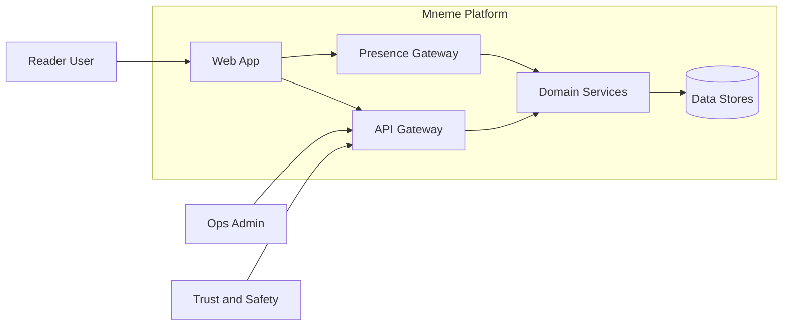
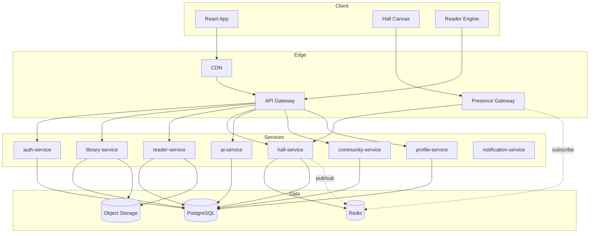
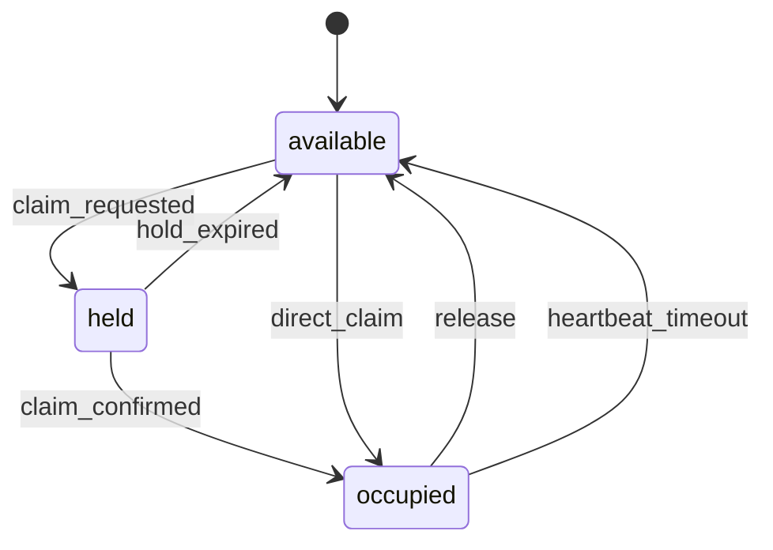
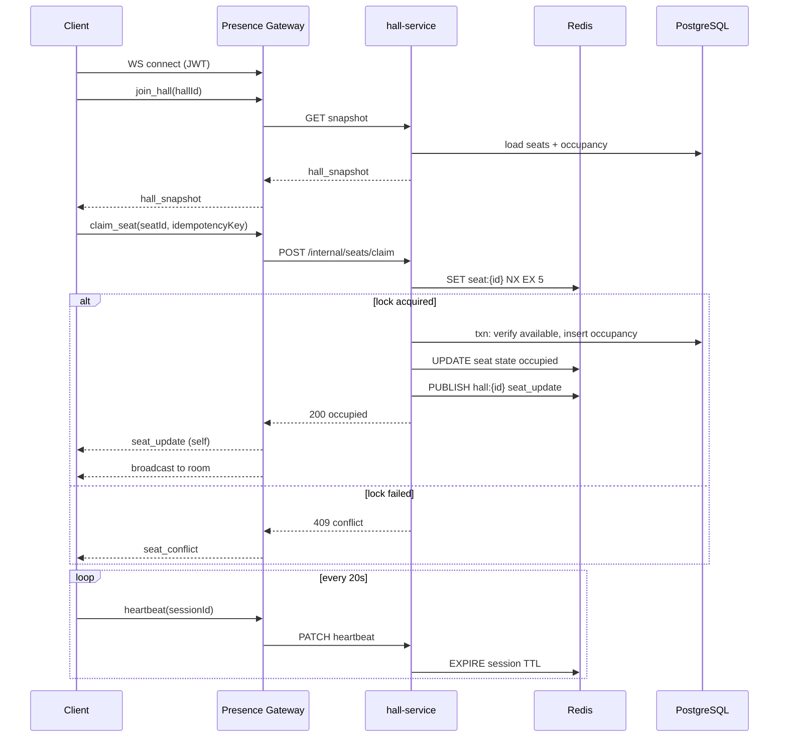
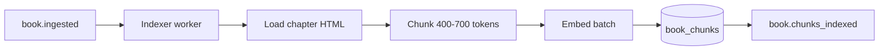
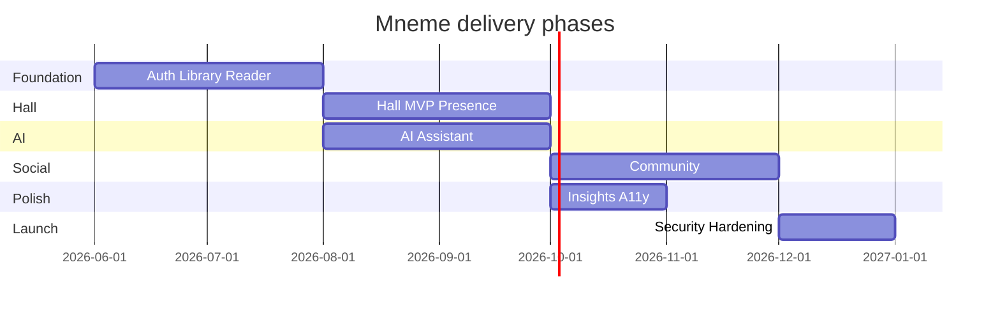

# Mneme — Intensive System Architecture

**Version:** 0.1 (planning)  
**Product:** Mneme — memory-centered reading platform with realtime Reading Halls  
**Status:** Pre-implementation specification

---

## Table of contents

1. [Executive summary](#1-executive-summary)
2. [Architecture principles](#2-architecture-principles)
3. [Context and scope](#3-context-and-scope)
4. [Logical architecture](#4-logical-architecture)
5. [Physical / deployment topology](#5-physical--deployment-topology)
6. [Service catalog](#6-service-catalog)
7. [Reading Hall — deep design](#7-reading-hall--deep-design)
8. [Realtime and presence layer](#8-realtime-and-presence-layer)
9. [Data architecture](#9-data-architecture)
10. [API specifications](#10-api-specifications)
11. [WebSocket protocol](#11-websocket-protocol)
12. [Event-driven architecture](#12-event-driven-architecture)
13. [AI subsystem](#13-ai-subsystem)
14. [Client architecture](#14-client-architecture)
15. [Cross-cutting concerns](#15-cross-cutting-concerns)
16. [Security architecture](#16-security-architecture)
17. [Observability and SLOs](#17-observability-and-slos)
18. [Scalability and resilience](#18-scalability-and-resilience)
19. [Disaster recovery and backup](#19-disaster-recovery-and-backup)
20. [Build phases and dependencies](#20-build-phases-and-dependencies)
21. [Appendices](#21-appendices)

---

## 1) Executive summary

Mneme is a **modular, event-augmented, realtime-capable** reading platform. The differentiator is the **Reading Hall**: a presence-first virtual space where users claim seats and read alongside others without exposing book content by default.

Core technical bets:

| Bet | Rationale |
|-----|-----------|
| PostgreSQL as system of record | ACID for library, progress, billing, audit |
| Redis for ephemeral state | Seat locks, presence, rate limits, pub/sub fan-out |
| Dedicated presence gateway | Isolate long-lived WS from REST latency |
| BFF aggregation | Reduce chatty mobile/web clients |
| Outbox + message bus | Reliable side effects (notifications, analytics) |
| AI provider abstraction | Swap models; centralize safety and logging |
| pgvector (MVP RAG) | Single DB for chunks + vectors until ~5M chunks |

### 1.1 Implementation strategy (decided)

| Phase | Deployable units |
|-------|------------------|
| **1–3 (MVP)** | `apps/api` modular monolith + `apps/web` |
| **2+** | Add `presence-gateway` when WS load requires isolation |
| **4+** | Extract `ai` module only if metrics demand |

See `docs/adr/001-modular-monolith.md`. Logical “services” in §6 are **modules**, not separate repos, until extraction.

---

## 2) Architecture principles

1. **Presence ≠ content** — Halls never stream page text without explicit opt-in.
2. **Server-authoritative seats** — Client UI is optimistic; Redis + DB reconcile conflicts.
3. **Bounded contexts** — Each domain owns its schema; integrate via APIs and events.
4. **Idempotent commands** — Seat claim, progress sync, AI jobs accept idempotency keys.
5. **Fail closed on auth** — Anonymous reads only for public catalog slices.
6. **Observable by default** — Correlation IDs from edge to worker.
7. **Privacy tiers** — Every presence payload carries a `visibility_tier`.

---

## 3) Context and scope

### In scope (v1 roadmap)

- Identity, library, EPUB/HTML reader, progress sync
- Reading Hall (public hall + one themed layout)
- AI assistant with book-scoped context
- Community (challenges, clubs, leaderboard)
- Profile analytics and accessibility prefs

### Out of scope (v1)

- Native mobile apps (web-first; API-ready)
- Real-time voice/video
- User-uploaded pirated content hosting
- Full-text search at web scale (Phase 2+)

### Stakeholder views



---

## 4) Logical architecture

### Layered view

```
┌─────────────────────────────────────────────────────────────────┐
│  Clients: Web (React), future iOS/Android                       │
├─────────────────────────────────────────────────────────────────┤
│  Edge: CDN, WAF, TLS termination                                  │
├─────────────────────────────────────────────────────────────────┤
│  API Gateway / BFF  │  Presence Gateway (WebSocket)              │
├─────────────────────┴───────────────────────────────────────────┤
│  Domain Services                                                  │
│  auth │ library │ reader │ hall │ ai │ community │ profile │ notify│
├─────────────────────────────────────────────────────────────────┤
│  Platform: event bus, job workers, search indexer (later)        │
├─────────────────────────────────────────────────────────────────┤
│  Data: PostgreSQL │ Redis │ Object Storage │ (OpenSearch later)  │
└─────────────────────────────────────────────────────────────────┘
```

### Domain map (bounded contexts)

| Context | Aggregate roots | Integrates with |
|---------|-----------------|-----------------|
| **Identity** | User, Session, Device | All |
| **Catalog** | Book, Chapter, Contributor | Library, Reader, AI |
| **Library** | Shelf, UserLibraryItem | Reader, Recommendations |
| **Reader** | ReadingSession, Bookmark, Highlight, ReaderPrefs | AI, Insights |
| **Hall** | ReadingHall, Seat, HallSession, SeatOccupancy | Presence GW, Identity |
| **AI** | Conversation, Message, PromptRun | Catalog, Reader |
| **Community** | Challenge, Club, Membership, LeaderboardEntry | Identity, Notify |
| **Insights** | DailyRollup, Achievement | Reader, Community |
| **Notifications** | Notification, DeliveryAttempt | All event publishers |



---

## 5) Physical / deployment topology

### Environment tiers

| Tier | Purpose | Data |
|------|---------|------|
| `local` | Developer docker-compose | Seeded fixtures |
| `dev` | Integration testing | Synthetic |
| `staging` | Pre-prod, load tests | Anonymized copy |
| `prod` | Live users | Real |

### Production (recommended baseline)

```
                    [Route53 / DNS]
                           │
                    [CloudFront CDN]
                           │
              ┌────────────┴────────────┐
              │      WAF + ALB          │
              └────────────┬────────────┘
         ┌──────────────────┼──────────────────┐
         │                  │                  │
   [API Gateway pods]  [Presence GW pods]  [Static S3]
         │                  │
         └────────┬─────────┘
                  │
    ┌─────────────┼─────────────┐
    │   EKS / ECS Cluster       │
    │  (domain microservices)   │
    └─────────────┬─────────────┘
                  │
    ┌─────────────┼─────────────┬──────────────┐
    │             │             │              │
 [RDS PG]    [ElastiCache]   [S3]      [SQS/SNS or Kafka]
  primary      Redis cluster   assets      event bus
  + replica
```

### Network zones

| Zone | Contents |
|------|----------|
| **Public** | CDN, WAF, ALB |
| **DMZ** | API GW, Presence GW |
| **Private** | All domain services, workers |
| **Data** | RDS, Redis (no public ingress) |

---

## 6) Service catalog

> **MVP mapping:** Each row below is a **module** inside `apps/api`. Only `presence-gateway` is a separate process in Phase 2+.

### 6.1 `auth-service`

| Responsibility | Details |
|----------------|---------|
| Registration / login | OAuth2 (Google, Apple), magic link, passkeys (phase 2) |
| Tokens | JWT access (15m), refresh (7d rotating), device binding |
| Sessions | List, revoke, suspicious login alerts |

**Key tables:** `users`, `auth_identities`, `sessions`, `refresh_tokens`

### 6.2 `library-service`

| Responsibility | Details |
|----------------|---------|
| Catalog | Books, metadata, covers, genres |
| User library | Shelves, reading status, favorites |
| Book detail BFF payloads | Overview, reviews aggregate, similar books |

**Key tables:** `books`, `book_genres`, `user_library_items`, `reviews`

### 6.3 `reader-service`

| Responsibility | Details |
|----------------|---------|
| Content delivery | Signed URLs for chapter assets in S3 |
| Progress | CFI / offset per chapter, last-read timestamp |
| Annotations | Bookmarks, highlights (offset + color + note) |
| Preferences | Font, spacing, margins, theme sync |

**Key tables:** `reading_sessions`, `bookmarks`, `highlights`, `reader_preferences`

### 6.4 `hall-service` (signature)

| Responsibility | Details |
|----------------|---------|
| Hall registry | CRUD halls, themes, capacity, visibility rules |
| Layouts | Seat coordinates, accessible seats, zones |
| Session lifecycle | Join, claim, heartbeat, leave, kick (moderation) |
| Policy | One seat per user per hall; global concurrent hall cap |

**Key tables:** `reading_halls`, `hall_layouts`, `seats`, `hall_sessions`, `seat_occupancies`

### 6.5 `presence-gateway`

| Responsibility | Details |
|----------------|---------|
| WebSocket termination | Auth via **short-lived presence ticket** (ADR 003) — not JWT in query string |
| Room management | `hall:{uuid}` channels |
| Fan-out | Redis pub/sub → all gateway instances |
| Backpressure | Max connections per IP / user |

**Does not own business rules** — forwards seat commands to `hall` module via internal HTTP only; never writes seats directly.

### 6.6 `ai-service`

| Responsibility | Details |
|----------------|---------|
| Conversations | Thread per user + optional book scope |
| Quick actions | Summary, quiz, flashcards, recommendations |
| RAG | Chunk retrieval from licensed/internal corpus |
| Safety | Moderation, PII scrub, token budgets |

**Key tables:** `ai_conversations`, `ai_messages`, `ai_prompt_runs`, `ai_feedback`

### 6.7 `community-service`

Challenges, book clubs, friend graph (phase 2), activity feed, leaderboard materialized views.

### 6.8 `profile-service`

Aggregates insights, achievements, accessibility settings, public profile card.

### 6.9 `notification-service`

Consumes events; delivers email, push (later), in-app inbox.

---

## 7) Reading Hall — deep design

### 7.1 Conceptual model

```
ReadingHall 1──1 HallLayout
ReadingHall 1──* Seat
HallSession *──1 User
HallSession 1──0..1 SeatOccupancy *──1 Seat
```

### 7.2 Hall types

| Type | `hall_type` | Access rule |
|------|-------------|-------------|
| Public | `public` | Any authenticated user |
| Club | `club` | `club_id` membership required |
| Book chapter | `book_chapter` | Optional: same `book_id` in library |
| Private invite | `private` | Invite token or host approval |

### 7.3 Seat state machine



| State | Meaning | TTL |
|-------|---------|-----|
| `available` | No lock | — |
| `held` | Soft lock during claim race | 5s |
| `occupied` | User seated | Heartbeat 30s |

### 7.4 Seat claim sequence (happy path)



### 7.5 Presence payload (what others see)

```json
{
  "seat_id": "uuid",
  "session_id": "uuid",
  "display": {
    "type": "initials | avatar | anonymous",
    "value": "MK"
  },
  "status": "active | paused | away",
  "visibility_tier": "public | friends | anonymous",
  "book_hint": {
    "enabled": false,
    "title_redacted": null
  },
  "optional_pulse": {
    "type": "highlight",
    "enabled": false
  }
}
```

**Default:** `book_hint.enabled = false`.

### 7.6 Hall themes (content design, not infra)

| Theme ID | Aesthetic | Max seats (default) |
|----------|-----------|---------------------|
| `scriptorium` | Candlelight, desks | 24 |
| `stoa` | Open colonnade | 40 |
| `lyceum` | Garden benches | 32 |
| `hearth` | Warm circular seating | 16 |

Layouts stored as JSON in `hall_layouts.definition`:

```json
{
  "version": 1,
  "grid": { "rows": 6, "cols": 8 },
  "seats": [
    { "id": "s1", "x": 1, "y": 2, "label": "A1", "accessible": true, "zone": "quiet" }
  ],
  "decor": { "background": "scriptorium_v1", "ambient_audio": "quill_soft.mp3" }
}
```

### 7.7 Conflict resolution

| Scenario | Resolution |
|----------|------------|
| Double claim same seat | First Redis `SET NX` wins; second gets `409` |
| User claims second seat while seated | Release previous seat in same txn |
| Ghost occupancy (crash) | Heartbeat TTL 90s → worker releases |
| Hall at capacity | `403 HALL_FULL`; suggest alternate hall |

### 7.8 Single mutation path (required)

All seat state changes **must** go through `hall` module internal API. No duplicate business logic in `presence-gateway`.

| Transport | Allowed role |
|-----------|----------------|
| WebSocket `claim_seat` / `release_seat` | Client UX → gateway → **hall internal API** |
| REST `POST .../seats/{id}/claim` | Optional for clients without WS; same internal handler |
| Redis | Locks + pub/sub only; not source of truth for occupancy |

**Rule:** One handler function `HallSeatService.claim(...)` used by both REST and WS adapters.

---

## 8) Realtime and presence layer

### 8.1 Why separate gateway

| Concern | REST API | Presence GW |
|---------|----------|---------------|
| Connection duration | Short | Hours |
| Scaling metric | RPS | Concurrent connections |
| Deploy risk | Standard release | Sticky sessions / connection draining |

### 8.2 Redis key schema

| Key pattern | Type | Purpose |
|-------------|------|---------|
| `hall:{hallId}:snapshot` | HASH | Denormalized seat states (cache) |
| `seat:{seatId}:lock` | STRING | Claim lock |
| `session:{sessionId}:hb` | STRING | Heartbeat TTL |
| `user:{userId}:hall` | STRING | Current hallId (fast lookup) |
| `channel:hall:{hallId}` | PUBSUB | Fan-out events |

### 8.3 Gateway horizontal scale

1. Client connects to any gateway pod (LB sticky optional).
2. Gateway subscribes to Redis channels for halls the client joined.
3. On `claim_seat`, gateway calls `hall-service`; service publishes to Redis; all gateways forward to local subscribers.

### 8.4 Connection limits (initial)

| Limit | Value |
|-------|-------|
| Max halls joined per connection | 1 (v1) |
| Max WS connections per user | 3 |
| Max payload size | 8 KB |
| Heartbeat interval | 20s client / 90s timeout |

---

## 9) Data architecture

### 9.1 PostgreSQL schema (core tables)

#### Identity

```sql
CREATE TABLE users (
  id            UUID PRIMARY KEY DEFAULT gen_random_uuid(),
  email         CITEXT UNIQUE NOT NULL,
  display_name  TEXT,
  avatar_url    TEXT,
  created_at    TIMESTAMPTZ NOT NULL DEFAULT now(),
  deleted_at    TIMESTAMPTZ
);

CREATE TABLE sessions (
  id            UUID PRIMARY KEY,
  user_id       UUID NOT NULL REFERENCES users(id),
  device_label  TEXT,
  ip_hash       TEXT,
  created_at    TIMESTAMPTZ NOT NULL DEFAULT now(),
  revoked_at    TIMESTAMPTZ
);
```

#### Catalog & library

```sql
CREATE TABLE books (
  id            UUID PRIMARY KEY,
  title         TEXT NOT NULL,
  slug          TEXT UNIQUE NOT NULL,
  cover_key     TEXT,
  metadata      JSONB NOT NULL DEFAULT '{}'
);

CREATE TABLE user_library_items (
  id            UUID PRIMARY KEY,
  user_id       UUID NOT NULL REFERENCES users(id),
  book_id       UUID NOT NULL REFERENCES books(id),
  status        TEXT NOT NULL CHECK (status IN ('want','reading','finished')),
  added_at      TIMESTAMPTZ NOT NULL DEFAULT now(),
  UNIQUE (user_id, book_id)
);
```

#### Reader

```sql
CREATE TABLE reading_sessions (
  id              UUID PRIMARY KEY,
  user_id         UUID NOT NULL REFERENCES users(id),
  book_id         UUID NOT NULL REFERENCES books(id),
  chapter_id      UUID,
  progress_offset NUMERIC NOT NULL DEFAULT 0,
  progress_cfi    TEXT,
  updated_at      TIMESTAMPTZ NOT NULL DEFAULT now(),
  UNIQUE (user_id, book_id)
);

CREATE TABLE highlights (
  id            UUID PRIMARY KEY,
  user_id       UUID NOT NULL REFERENCES users(id),
  book_id       UUID NOT NULL REFERENCES books(id),
  range_start   TEXT NOT NULL,
  range_end     TEXT NOT NULL,
  color         TEXT NOT NULL,
  note          TEXT,
  created_at    TIMESTAMPTZ NOT NULL DEFAULT now()
);
```

#### Reading Hall

```sql
CREATE TABLE reading_halls (
  id            UUID PRIMARY KEY,
  slug          TEXT UNIQUE NOT NULL,
  name          TEXT NOT NULL,
  hall_type     TEXT NOT NULL,
  theme_id      TEXT NOT NULL,
  capacity      INT NOT NULL,
  club_id       UUID,
  book_id       UUID,
  is_active     BOOLEAN NOT NULL DEFAULT true,
  created_at    TIMESTAMPTZ NOT NULL DEFAULT now()
);

CREATE TABLE hall_layouts (
  hall_id       UUID PRIMARY KEY REFERENCES reading_halls(id),
  version       INT NOT NULL,
  definition    JSONB NOT NULL
);

CREATE TABLE seats (
  id            UUID PRIMARY KEY,
  hall_id       UUID NOT NULL REFERENCES reading_halls(id),
  seat_key      TEXT NOT NULL,
  zone          TEXT,
  is_accessible BOOLEAN NOT NULL DEFAULT false,
  UNIQUE (hall_id, seat_key)
);

CREATE TABLE hall_sessions (
  id              UUID PRIMARY KEY,
  user_id         UUID NOT NULL REFERENCES users(id),
  hall_id         UUID NOT NULL REFERENCES reading_halls(id),
  visibility_tier TEXT NOT NULL DEFAULT 'friends',
  joined_at       TIMESTAMPTZ NOT NULL DEFAULT now(),
  left_at         TIMESTAMPTZ
);

CREATE TABLE seat_occupancies (
  id              UUID PRIMARY KEY,
  hall_session_id UUID NOT NULL REFERENCES hall_sessions(id),
  seat_id         UUID NOT NULL REFERENCES seats(id),
  status          TEXT NOT NULL CHECK (status IN ('occupied')),
  last_heartbeat  TIMESTAMPTZ NOT NULL DEFAULT now(),
  released_at     TIMESTAMPTZ
);

-- One active occupant per seat (held state lives in Redis only, 5s TTL)
CREATE UNIQUE INDEX seat_one_occupant
  ON seat_occupancies (seat_id)
  WHERE released_at IS NULL;
```

#### RAG (book corpus)

```sql
CREATE EXTENSION IF NOT EXISTS vector;

CREATE TABLE book_chunks (
  id           UUID PRIMARY KEY DEFAULT gen_random_uuid(),
  book_id      UUID NOT NULL REFERENCES books(id) ON DELETE CASCADE,
  chapter_id   UUID NOT NULL,
  chunk_index  INT NOT NULL,
  content      TEXT NOT NULL,
  token_count  INT NOT NULL,
  cfi_start    TEXT,
  cfi_end      TEXT,
  embedding    vector(1536),
  metadata     JSONB NOT NULL DEFAULT '{}',
  created_at   TIMESTAMPTZ NOT NULL DEFAULT now(),
  UNIQUE (book_id, chapter_id, chunk_index)
);

CREATE INDEX book_chunks_book_id_idx ON book_chunks (book_id);
CREATE INDEX book_chunks_embedding_hnsw
  ON book_chunks USING hnsw (embedding vector_cosine_ops);

-- Optional: user highlight passages for personal RAG (consent-gated)
CREATE TABLE highlight_chunks (
  id           UUID PRIMARY KEY DEFAULT gen_random_uuid(),
  user_id      UUID NOT NULL REFERENCES users(id) ON DELETE CASCADE,
  highlight_id UUID NOT NULL REFERENCES highlights(id) ON DELETE CASCADE,
  book_id      UUID NOT NULL REFERENCES books(id) ON DELETE CASCADE,
  content      TEXT NOT NULL,
  embedding    vector(1536),
  created_at   TIMESTAMPTZ NOT NULL DEFAULT now()
);

CREATE INDEX highlight_chunks_user_book_idx ON highlight_chunks (user_id, book_id);
```

#### Idempotency

```sql
CREATE TABLE idempotency_keys (
  key           TEXT PRIMARY KEY,
  user_id       UUID NOT NULL REFERENCES users(id),
  response_body JSONB NOT NULL,
  status_code   INT NOT NULL,
  created_at    TIMESTAMPTZ NOT NULL DEFAULT now(),
  expires_at    TIMESTAMPTZ NOT NULL
);
```

#### AI

```sql
CREATE TABLE ai_conversations (
  id            UUID PRIMARY KEY,
  user_id       UUID NOT NULL REFERENCES users(id),
  book_id       UUID REFERENCES books(id),
  title         TEXT,
  created_at    TIMESTAMPTZ NOT NULL DEFAULT now()
);

CREATE TABLE ai_messages (
  id              UUID PRIMARY KEY,
  conversation_id UUID NOT NULL REFERENCES ai_conversations(id),
  role            TEXT NOT NULL CHECK (role IN ('user','assistant','system')),
  content         TEXT NOT NULL,
  token_count     INT,
  created_at      TIMESTAMPTZ NOT NULL DEFAULT now()
);
```

### 9.2 Indexing strategy

| Table | Index | Reason |
|-------|-------|--------|
| `user_library_items` | `(user_id, status)` | Library filters |
| `reading_sessions` | `(user_id, updated_at DESC)` | Continue reading |
| `seat_occupancies` | `(hall_id, status)` | Hall snapshot |
| `hall_sessions` | `(user_id) WHERE left_at IS NULL` | Active session lookup |
| `ai_messages` | `(conversation_id, created_at)` | Chat history |
| `book_chunks` | `(book_id)` | RAG filter |
| `books` | GIN `to_tsvector(title \|\| author \|\| description)` | Catalog FTS (MVP) |

### 9.3 Caching policy

| Data | Cache | TTL | Invalidation |
|------|-------|-----|--------------|
| Hall snapshot | Redis | 2s | On seat event |
| Book metadata | CDN + Redis | 1h | Version bump |
| User prefs | Redis | 15m | On write |
| Leaderboard | Redis | 5m | Cron refresh |
| RAG query result | Redis | 1h | `book_id` + hash(query) |

### 9.4 Object storage layout (S3)

```
s3://mneme-assets/
  books/{book_id}/chapters/{chapter_id}.html
  books/{book_id}/covers/{size}.webp
  users/{user_id}/avatars/{hash}.webp
  halls/{hall_id}/themes/{asset}.png
```

---

## 10) API specifications

**Base URL:** `https://api.mneme.app/v1`  
**Auth:** `Authorization: Bearer <access_token>`  
**Errors:** RFC 7807 `application/problem+json`

### 10.1 Auth

| Method | Path | Description |
|--------|------|-------------|
| POST | `/auth/magic-link` | Request email link |
| POST | `/auth/token` | Exchange code / refresh |
| GET | `/auth/sessions` | List devices |
| DELETE | `/auth/sessions/{id}` | Revoke |

### 10.2 Library

| Method | Path | Description |
|--------|------|-------------|
| GET | `/books` | Catalog search (cursor) |
| GET | `/books/{id}` | Detail |
| GET | `/me/library` | User library |
| POST | `/me/library` | Add book |
| PATCH | `/me/library/{itemId}` | Update status |

### 10.3 Reader

| Method | Path | Description |
|--------|------|-------------|
| GET | `/books/{id}/chapters/{chapterId}/content` | Signed URL redirect |
| PUT | `/me/reading-sessions/{bookId}` | Upsert progress |
| GET | `/me/highlights?bookId=` | List |
| POST | `/me/highlights` | Create |
| GET | `/me/reader-preferences` | Get prefs |
| PATCH | `/me/reader-preferences` | Update prefs |

### 10.4 Presence and Reading Hall

| Method | Path | Description |
|--------|------|-------------|
| POST | `/presence/ticket` | Issue short-lived WS ticket (60s, single-use) |
| GET | `/halls` | List halls (filter `type`, `theme`) |
| GET | `/halls/{id}` | Hall metadata + layout |
| GET | `/halls/{id}/snapshot` | Seat occupancy map |
| POST | `/halls/{id}/sessions` | Join hall (create `hall_session`) |
| DELETE | `/halls/{id}/sessions/{sessionId}` | Leave |
| POST | `/halls/{id}/seats/{seatId}/claim` | Claim (header `Idempotency-Key`) — same handler as WS |
| POST | `/halls/{id}/seats/{seatId}/release` | Release |
| PATCH | `/halls/{id}/sessions/{sessionId}/presence` | Status / visibility |

**Presence ticket response 200:**

```json
{
  "ticket": "opaque-single-use-string",
  "expires_at": "2026-06-02T12:01:00Z"
}
```

**Claim response 200:**

```json
{
  "seat_id": "uuid",
  "session_id": "uuid",
  "status": "occupied",
  "occupant_display": { "type": "initials", "value": "MK" }
}
```

### 10.5 AI

| Method | Path | Description |
|--------|------|-------------|
| GET | `/me/ai/conversations` | List |
| POST | `/me/ai/conversations` | Create (optional `book_id`) |
| POST | `/me/ai/conversations/{id}/messages` | Send message |
| POST | `/me/ai/quick-actions` | `{ "action": "summary", "book_id": "..." }` — returns `job_id` |
| GET | `/me/ai/jobs/{jobId}` | Poll or SSE stream for completion |

**AI message response** includes `citations: [{ "chunk_id", "cfi_start", "cfi_end", "excerpt" }]`.

### 10.6 BFF screen endpoints (optional aggregation)

| Method | Path | Aggregates |
|--------|------|------------|
| GET | `/screens/home` | continue reading, hall teaser, insight |
| GET | `/screens/book/{id}` | detail tabs payload |
| GET | `/screens/profile` | stats + badges + prefs |

---

## 11) WebSocket protocol

**URL:** `wss://presence.mneme.app/v1` (no credentials in query string)

### 11.0 Connection handshake

1. `POST /v1/presence/ticket` with Bearer JWT.
2. Connect WebSocket.
3. First message **must** be `auth` with ticket.
4. Server responds `auth_ok` or closes with `4401`.
5. Then `join_hall`, `claim_seat`, etc.

See `docs/adr/003-presence-ticket-auth.md`.

### 11.1 Envelope

```json
{
  "type": "event_name",
  "request_id": "uuid",
  "ts": "2026-06-02T12:00:00Z",
  "payload": {}
}
```

### 11.2 Client → Server

| type | payload |
|------|---------|
| `auth` | `{ "ticket": "opaque" }` |
| `join_hall` | `{ "hall_id": "uuid" }` |
| `leave_hall` | `{ "hall_id": "uuid" }` |
| `claim_seat` | `{ "hall_id", "seat_id", "idempotency_key" }` |
| `release_seat` | `{ "hall_id", "seat_id" }` |
| `heartbeat` | `{ "session_id": "uuid" }` |
| `update_presence` | `{ "session_id", "status", "visibility_tier" }` |

### 11.3 Server → Client

| type | payload |
|------|---------|
| `auth_ok` | `{ "user_id": "uuid" }` |
| `hall_snapshot` | Full seat map + `hall_gen` version |
| `seat_update` | Single seat change |
| `presence_update` | Occupant status change |
| `seat_conflict` | `{ "seat_id", "reason" }` |
| `error` | `{ "code", "message" }` |

---

## 12) Event-driven architecture

### 12.1 Bus selection

| Stage | Technology |
|-------|------------|
| MVP | SNS/SQS or Redis streams |
| Scale | Kafka / MSK |

### 12.2 Domain events (catalog)

| Event | Producer | Consumers |
|-------|----------|-----------|
| `user.registered` | auth | notify, insights |
| `book.added_to_library` | library | recommendations |
| `reading.progress_updated` | reader | insights, challenges |
| `hall.seat_claimed` | hall | analytics, friends feed |
| `hall.session_ended` | hall | insights |
| `book.ingested` | library | **RAG indexer worker** |
| `book.chunks_indexed` | worker | catalog `rag_status=ready` |
| `ai.message_completed` | ai | billing, safety audit |
| `challenge.completed` | community | notify, badges |

### 12.3 Outbox pattern

Each service writes business row + `outbox_events` in one transaction. Worker polls outbox → publishes to bus → marks sent.

```sql
CREATE TABLE outbox_events (
  id            UUID PRIMARY KEY,
  aggregate_type TEXT NOT NULL,
  aggregate_id  UUID NOT NULL,
  event_type    TEXT NOT NULL,
  payload       JSONB NOT NULL,
  created_at    TIMESTAMPTZ NOT NULL DEFAULT now(),
  published_at  TIMESTAMPTZ
);
```

---

## 13) AI / RAG subsystem

See `docs/adr/002-rag-pgvector-mvp.md`.

### 13.1 Where RAG applies

| Feature | RAG? | Mechanism |
|---------|------|-----------|
| In-reader Q&A | Yes | `book_chunks` + optional CFI boost |
| Summary / quiz / flashcards | Yes | Retrieve then generate structured output |
| AI chat (`book_id`) | Yes | Same retriever |
| Catalog search | Hybrid | PG `tsvector` MVP; OpenSearch phase 3 |
| Recommendations | No | Metadata embeddings + behavior (not chunk RAG) |
| Reading Hall | No | Presence only |

### 13.2 Ingestion pipeline (async)



| Step | Rule |
|------|------|
| Chunking | 400–700 tokens, 10–15% overlap, respect paragraph boundaries |
| Embedding | `text-embedding-3-small` (1536d) or `bge-m3` (self-host) |
| Rights | Only `books.rag_indexable = true` |
| Idempotency | Upsert on `(book_id, chapter_id, chunk_index)` |

Add column: `books.rag_status` ∈ `pending | indexing | ready | failed`.

### 13.3 Retrieval pipeline (query time)

```
User message + book_id + optional cfi
  → Embed query
  → SELECT ... FROM book_chunks WHERE book_id = $1
      ORDER BY embedding <=> $query LIMIT 20
  → Optional: boost chunks near CFI
  → Rerank 20 → 5 (cross-encoder or Cohere Rerank)
  → If consent: UNION highlight_chunks (user_id, book_id) top 3
  → Wrap excerpts in <excerpt id="..."> (anti-injection)
  → LLM with grounding instruction + citations
```

**Grounding instruction (system):** Answer only from provided excerpts; if insufficient, say so. Never invent plot points.

### 13.4 Async AI jobs (scalability)

`POST /me/ai/conversations/{id}/messages` returns `202` + `job_id`. Worker runs pipeline; client consumes `GET /me/ai/jobs/{id}` via **SSE**.

Prevents blocking HTTP workers during 5–30s LLM calls. Rate limit: **50 RAG requests / user / day** (configurable tier).

### 13.5 Context budget

| Source | Max tokens (default) |
|--------|----------------------|
| System policy | 800 |
| Retrieved book excerpts | 3000 |
| User highlights (if consented) | 1000 |
| Chat history | 2000 |

### 13.6 Quick actions (retrieval strategy)

| Action | Template | Retrieval |
|--------|----------|-----------|
| Summary | `book.summary.v1` | MMR diverse chunks (book or chapter scope) |
| Quiz | `book.quiz.v1` | Fact-dense chunks → JSON questions |
| Flashcards | `book.flashcards.v1` | Same; SRS metadata in app DB |
| Recommendations | `user.recs.v1` | **Not chunk RAG** — book metadata vectors + history |

### 13.7 Response contract (citations)

```json
{
  "message": { "role": "assistant", "content": "..." },
  "citations": [
    {
      "chunk_id": "uuid",
      "chapter_id": "uuid",
      "cfi_start": "epubcfi(...)",
      "cfi_end": "epubcfi(...)",
      "excerpt": "short preview for UI"
    }
  ]
}
```

Client uses `cfi_start` to jump in reader.

### 13.8 Scale-out path for vectors

| Trigger | Action |
|---------|--------|
| > ~5M chunks or retrieval p95 > 100ms | Dual-write to Qdrant / OpenSearch k-NN |
| > 50 RAG QPS sustained | Dedicated `ai-worker` replicas + Redis query cache |
| Eval recall@5 drops | Block deploy; tune chunk size or reranker |

### 13.9 RAG evaluation (quality gate)

- 50 questions per genre with expected chapter/chunk
- **Recall@5 ≥ 80%** before embedding model changes
- Log `ai_prompt_runs` with `chunk_ids_used[]` for audit

See `docs/TESTING.md` §5.

---

## 14) Client architecture

### 14.1 Monorepo layout (planned)

```
apps/
  web/                 # React + Vite
packages/
  ui/                  # Design system (parchment tokens)
  reader-engine/       # EPUB/HTML rendering
  hall-canvas/         # Seat map renderer
  api-client/          # Typed OpenAPI client
  ws-client/           # Presence protocol
```

### 14.2 State management

| State | Store | Sync |
|-------|-------|------|
| Auth | Secure httpOnly cookie + memory access token | Refresh rotation |
| Library | React Query | REST |
| Reader | Zustand + IndexedDB | Optimistic PUT progress |
| Hall | Zustand + WS | Server authoritative |
| AI chat | React Query + stream | REST + SSE |

### 14.3 Hall canvas rendering

- **v1:** HTML/CSS grid or Canvas 2D (isometric fake via CSS transforms)
- **v2:** PixiJS/WebGL for animated ambience
- Hit-testing per seat polygon; keyboard navigation for a11y

### 14.4 Offline behavior

- Reader caches current chapter in IndexedDB
- Progress queue flushes on reconnect
- Hall requires online; graceful banner if offline

---

## 15) Cross-cutting concerns

| Concern | Approach |
|---------|----------|
| **i18n** | `react-i18next`; RTL-ready layout |
| **a11y** | WCAG 2.2 AA; seat map keyboard roving tabindex |
| **Feature flags** | LaunchDarkly or open-source Flipt |
| **Config** | Env + remote config for hall capacity |
| **Migrations** | Flyway/Liquibase per service schema |

---

## 16) Security architecture

### 16.1 Threat model (STRIDE highlights)

| Threat | Mitigation |
|--------|------------|
| Spoofing | JWT + short TTL; refresh rotation |
| Tampering | TLS; signed URLs for content |
| Repudiation | Audit log for admin/mod actions |
| Information disclosure | Hall presence tiers; no page leak |
| DoS | Rate limits; WS connection caps |
| Elevation | RBAC; internal APIs mTLS |

### 16.2 Authorization matrix (excerpt)

| Resource | Owner | Friend | Public |
|----------|-------|--------|--------|
| Highlights | CRUD | — | — |
| Hall seat | CRUD | view presence | view if public hall |
| AI conversation | CRUD | — | — |
| Profile stats | read | read if allowed | read if public profile |

### 16.3 Content security

- CSP strict on web app
- Sanitize AI-rendered markdown
- No `eval` in reader engine

---

## 17) Observability and SLOs

### 17.1 SLIs / SLOs (initial)

| SLI | SLO (30d) |
|-----|-----------|
| API availability | 99.9% |
| API p95 latency (read) | < 300ms |
| WS connect success | 99.5% |
| Seat claim success (non-conflict) | 99.9% |
| AI response p95 | < 8s |

### 17.2 Golden signals per service

- Latency, traffic, errors, saturation (CPU/memory)
- Custom: `hall.active_sessions`, `hall.seat_conflicts`, `ai.tokens_used`

### 17.3 Tracing

OpenTelemetry: trace from `join_hall` → `hall-service` → Redis → DB.

---

## 18) Scalability and resilience

### 18.1 Load estimates (planning)

| Metric | Launch | 12mo target |
|--------|--------|-------------|
| DAU | 5k | 200k |
| Concurrent hall users | 500 | 20k |
| WS connections | 1k | 40k |

### 18.2 Scaling levers

| Component | Scale lever |
|-----------|-------------|
| API | HPA on CPU/RPS |
| Presence GW | Connection-based HPA |
| Redis | Cluster mode; hash tags per hall |
| PostgreSQL | Read replicas; partition `ai_messages` by month |
| CDN | Static assets and chapter cache |

### 18.3 Failure modes

| Failure | User impact | Mitigation |
|---------|-------------|------------|
| Redis down | Cannot claim seats | Degrade: solo reading only banner |
| PG primary down | Full outage | Failover replica; status page |
| AI provider timeout | Chat fails | Cached fallback message; retry |
| Single GW pod crash | Reconnect | Client exponential backoff |

### 18.4 Chaos drills (pre-launch)

- Kill Redis node during hall peak test
- Drain presence pods with 10k connections
- Simulate AI 429 rate limit storm

---

## 19) Disaster recovery and backup

| Asset | RPO | RTO | Method |
|-------|-----|-----|--------|
| PostgreSQL | 5 min | 30 min | RDS PITR |
| Redis presence | N/A (ephemeral) | — | Rebuild from DB snapshot on reconnect |
| S3 assets | 0 | 1h | Versioning + cross-region replica |

---

## 20) Build phases and dependencies



| Phase | Delivers | Depends on |
|-------|----------|------------|
| 1 | Auth, library, reader | — |
| 2 | Hall + presence GW | Phase 1 auth |
| 3 | AI | Phase 1 catalog/reader |
| 4 | Community | Phase 1 identity |
| 5 | Insights | Reader events |
| 6 | Production hardening | All |

---

## 21) Appendices

### A. Glossary

| Term | Definition |
|------|------------|
| **Mneme** | Greek personification of memory; platform brand |
| **Reading Hall** | Virtual room with seat map and presence |
| **Presence** | Seat + status + display rules without book text |
| **BFF** | Backend-for-frontend aggregation layer |

### B. Related documents

- `SECURITY_PRIVACY.md` — policy draft, presence privacy, checklists
- `README.md` — product summary
- `demo.html` — UX planning demo

### C. Architecture decisions log

| ID | Question | Status | Decision |
|----|----------|--------|----------|
| OD-1 | Monolith vs microservices | **Closed** | Modular monolith — ADR 001 |
| OD-2 | WS library | Open | `ws` + Redis pub/sub (prefer over Socket.io at scale) |
| OD-3 | Catalog search | **MVP closed** | PG FTS; OpenSearch phase 3 |
| OD-4 | Mobile | Open | PWA first |
| OD-5 | RAG store | **Closed** | pgvector MVP — ADR 002 |
| OD-6 | WS auth | **Closed** | Presence ticket — ADR 003 |

---

*Document owner: Engineering · Mneme · Last updated: planning phase*
