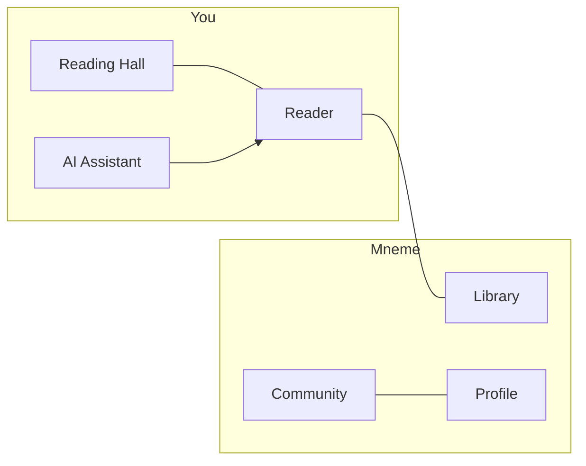

<div align="center">

# Mneme

### *Memory made social.*

**Μνήμη** · Greek for *memory* · mother of the Muses

<br />

[](https://github.com/khushi-o/Mneme)
[](ARCHITECTURE.md)
[](#)

[Explore docs](#-documentation) · [Reading Hall](#-reading-hall) · [Architecture](ARCHITECTURE.md) · [Live demo plan](demo.html)

<br />

*A feminine, archival-modern reading platform.*  
Warm parchment tones · **Fraunces** for headings · **DM Sans** for UI

</div>

---

## ◈ What is Mneme?

Mneme is where **deep reading** meets **quiet companionship**. Open a book in a beautiful reader, sit in a virtual **Reading Hall** beside others, and ask an AI that answers from the text—not from guesswork.

| | |
|:--|:--|
| **Read** | Typography, themes, highlights, bookmarks |
| **Gather** | Choose your seat · read together in presence |
| **Remember** | RAG-grounded summaries, flashcards, quizzes—with citations |
| **Belong** | Clubs, challenges, leaderboards |

> *The hall shares who is reading—not what is on the page.*

---

## ◈ Reading Hall

The signature experience: a visual hall, a seat map, and the feeling of a shared library without noise.

```
  Enter hall  →  Pick a seat  →  Presence goes live  →  Read in flow
```

| | |
|:--|:--|
| **Seats** | Available · occupied · friends nearby |
| **Halls** | Public · club · book-chapter rooms |
| **Presence** | Active · paused · away |
| **Privacy** | Anonymous seat · friends-only · do-not-disturb |

---

## ◈ Platform at a glance



| Screen | What you do |
|--------|-------------|
| **Home** | Continue reading · enter a hall · daily insight |
| **Library** | Shelves · search · book detail |
| **Reading Hall** | Browse halls · claim a seat · quiet presence |
| **Reader** | Read · highlight · AI panel with citations |
| **AI Assistant** | Chat · summary · quiz · flashcards |
| **Community** | Challenges · clubs · leaderboard |
| **Profile** | Stats · achievements · accessibility |

---

## ◈ Documentation

| | Document | |
|:--:|----------|--|
| 📐 | [**ARCHITECTURE.md**](ARCHITECTURE.md) | Full system design — modules, RAG, APIs, scale |
| 🔒 | [**SECURITY_PRIVACY.md**](SECURITY_PRIVACY.md) | Security, privacy, hall & vector data |
| 📋 | [**docs/AUDIT.md**](docs/AUDIT.md) | Architecture audit & remediation |
| 🧪 | [**docs/TESTING.md**](docs/TESTING.md) | Testing & RAG eval strategy |
| 📁 | [**docs/adr/**](docs/adr/) | Architecture decision records |
| 🎨 | [**demo.html**](demo.html) | Interactive planning demo *(open in browser)* |

<details>
<summary><strong>Accepted architecture decisions</strong></summary>

| ADR | Decision |
|-----|----------|
| [001](docs/adr/001-modular-monolith.md) | Modular monolith for MVP |
| [002](docs/adr/002-rag-pgvector-mvp.md) | RAG on PostgreSQL + pgvector |
| [003](docs/adr/003-presence-ticket-auth.md) | Short-lived tickets for WebSocket auth |

</details>

---

## ◈ Tech stack

| Layer | Technology |
|-------|------------|
| **Frontend** | React · TypeScript |
| **API** | Modular monolith (NestJS or Express) |
| **Realtime** | Presence gateway · Redis pub/sub |
| **Database** | PostgreSQL · **pgvector** |
| **AI** | RAG pipeline · async workers · provider abstraction |
| **Assets** | S3-compatible storage |

---

## ◈ Roadmap

| Phase | Focus |
|:-----:|-------|
| **1** | Auth · library · reader |
| **2** | Reading Hall MVP · presence · ticket auth |
| **3** | AI + RAG · ingestion · citations |
| **4** | Community · clubs · challenges |
| **5** | Insights · accessibility |
| **6** | Scale · compliance · hardening |

---

## ◈ Project status

| | |
|:--|:--|
| **Now** | Planning & documentation — [architecture](ARCHITECTURE.md) is implementation-ready |
| **Next** | `docker-compose` · OpenAPI spec · `apps/api` scaffold |

---

<div align="center">

**[github.com/khushi-o/Mneme](https://github.com/khushi-o/Mneme)**

*Built for readers who want memory, presence, and pages that matter.*

<br />

<sub>Mneme · Μνήμη · 2026</sub>

</div>
