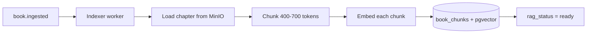
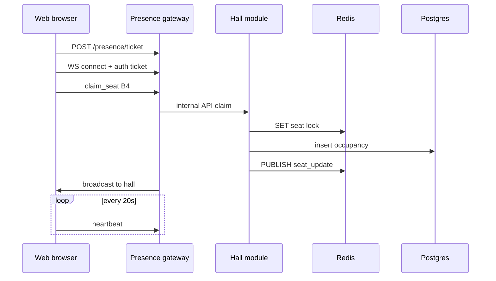

# Mneme — Complete Project Guide

Everything in this repository, what it does, why it exists, and how the pieces connect.

**Repo:** [github.com/khushi-o/Mneme](https://github.com/khushi-o/Mneme)

---

## Table of contents

1. [What is Mneme?](#1-what-is-mneme)
2. [Repository map](#2-repository-map)
3. [Documentation files](#3-documentation-files)
4. [Application code](#4-application-code)
5. [Infrastructure (Docker)](#5-infrastructure-docker)
6. [Tech stack and why](#6-tech-stack-and-why)
7. [How data flows](#7-how-data-flows)
8. [Deep dives (with diagrams)](#8-deep-dives-with-diagrams)
9. [Roadmap and status](#9-roadmap-and-status)
10. [Daily commands](#10-daily-commands)
11. [What to push to Git](#11-what-to-push-to-git)

---

## 1. What is Mneme?

**Mneme** (Greek: Μνήμη — *memory*) is a reading platform where:

- You read books in a beautiful, customizable reader
- You join **Reading Halls** — pick a virtual seat and read alongside others in quiet presence
- An **AI assistant** answers from the book (RAG), not random guesses
- **Community** features motivate you (challenges, clubs, leaderboard)

**Brand feel:** Feminine, archival-modern, warm parchment UI, Fraunces + DM Sans fonts.

**Current phase:** Foundation built (docs + monorepo + Docker recipe + first API routes). Auth, full reader, hall, and AI are next.

---

## 2. Repository map

```
Mneme/
├── README.md                 # Project front page (GitHub)
├── ARCHITECTURE.md           # Full technical spec (~1200 lines)
├── SECURITY_PRIVACY.md       # Security + privacy policy draft
├── demo.html                 # UX planning page (open in browser)
├── docker-compose.yml        # Local Postgres, Redis, MinIO
├── package.json              # Monorepo root scripts
├── package-lock.json         # Locked dependency versions (push this)
├── .env.example              # Environment template (push this)
├── .gitignore                # Files Git should ignore
│
├── apps/
│   ├── api/                  # Backend (@mneme/api)
│   │   ├── migrations/       # SQL schema
│   │   └── src/
│   │       ├── modules/      # auth, library, reader, hall, ai, health
│   │       ├── db/           # pool, migrate, seed
│   │       └── middleware/
│   └── web/                  # Frontend (@mneme/web)
│       └── src/              # React app
│
├── packages/
│   └── shared/               # Shared types (@mneme/shared)
│
├── docker/
│   └── postgres/init.sql     # pgvector + extensions on first boot
│
└── docs/
    ├── GUIDE.md              # ← You are here
    ├── GETTING_STARTED.md    # Setup steps
    ├── GIT.md                # Push checklist
    ├── AUDIT.md              # Architecture audit
    ├── TESTING.md            # Test strategy
    └── adr/                  # Architecture Decision Records
        ├── 001-modular-monolith.md
        ├── 002-rag-pgvector-mvp.md
        └── 003-presence-ticket-auth.md
```

---

## 3. Documentation files

| File | Purpose | Audience |
|------|---------|----------|
| **README.md** | Overview, badges, links | Everyone visiting GitHub |
| **ARCHITECTURE.md** | Services, APIs, SQL, RAG, hall, scale | Engineers |
| **SECURITY_PRIVACY.md** | Security controls, privacy draft, RAG/hall rules | Legal + engineering |
| **demo.html** | Screen flow mockup | Design / stakeholders |
| **docs/GUIDE.md** | This file — full project tour | You + recruiters |
| **docs/GETTING_STARTED.md** | Install, Docker, migrate, seed, run | Developers |
| **docs/GIT.md** | What to commit vs ignore | Developers |
| **docs/AUDIT.md** | What was reviewed and fixed | Engineering |
| **docs/TESTING.md** | Unit → E2E → RAG eval → k6 | QA / engineering |
| **docs/adr/** | Locked decisions (monolith, pgvector, WS tickets) | Engineering |

---

## 4. Application code

### apps/api — Backend brain

**Stack:** Express + TypeScript + PostgreSQL (`pg`)

| Module | Route prefix | Status | Phase |
|--------|--------------|--------|-------|
| health | `GET /health`, `GET /ready` | ✅ Working | 1 |
| library | `GET /v1/books`, `GET /v1/books/:slug` | ✅ Working | 1 |
| auth | `/v1/auth` | 🚧 Scaffold | 1 |
| reader | `/v1/reader` | 🚧 Scaffold | 1 |
| hall | `/v1/halls` | 🚧 Scaffold | 2 |
| ai | `/v1/ai` | 🚧 Scaffold | 3 |

**Key files:**

| File | Role |
|------|------|
| `src/index.ts` | Express app, CORS, route mounting |
| `src/config.ts` | Reads `.env`, validates with Zod |
| `src/db/pool.ts` | PostgreSQL connection pool |
| `src/db/migrate.ts` | Runs `migrations/*.sql` |
| `src/db/seed.ts` | Demo user + 3 books |
| `migrations/001_init.sql` | All core tables + pgvector |

### apps/web — Frontend face

**Stack:** React 19 + Vite + TypeScript

| File | Role |
|------|------|
| `src/App.tsx` | Home page, health check, book list |
| `src/index.css` | Parchment design tokens |
| `vite.config.ts` | Dev server + proxy to API |

**URLs (local):** http://localhost:5173

### packages/shared

Placeholder for shared constants and types used by both apps later.

---

## 5. Infrastructure (Docker)

**File:** `docker-compose.yml`

| Service | Image | Port | Role |
|---------|-------|------|------|
| postgres | pgvector/pgvector:pg16 | 5432 | Database + vectors |
| redis | redis:7-alpine | 6379 | Cache, presence (Phase 2) |
| minio | minio/minio | 9000, 9001 | File storage (S3-compatible) |
| minio-init | minio/mc | — | Creates `mneme-assets` bucket |

**Init script:** `docker/postgres/init.sql` enables `pgcrypto`, `citext`, `vector`.

**Requires:** [Docker Desktop](https://www.docker.com/products/docker-desktop/) installed.

---

## 6. Tech stack and why

### Chosen

| Layer | Choice | Why |
|-------|--------|-----|
| Monorepo | npm workspaces | One repo, shared tooling |
| API | Express modular monolith | Simple MVP; split later if needed |
| Frontend | React + Vite | Fast dev, huge ecosystem |
| Language | TypeScript | Fewer bugs, better IDE help |
| Database | PostgreSQL + pgvector | One DB for app + RAG vectors |
| Cache | Redis | Hall presence, tickets, cache |
| Files | MinIO (local) / S3 (prod) | Standard object storage API |
| Containers | Docker Compose | Same setup for every developer |

### Not chosen (yet) and why

| Alternative | Why not now |
|-------------|-------------|
| 9 microservices | Too much ops before users |
| NestJS | More boilerplate; Express enough for MVP |
| Next.js | App is login-first; Vite is lighter |
| MongoDB | Relational data fits SQL better |
| Pinecone / Qdrant | pgvector until ~5M chunks |
| Firebase only | Less control for halls + RAG + privacy |

See `docs/adr/` for formal decisions.

---

## 7. How data flows

### Today (working path)

```
Browser (web)
    → GET /v1/books (via Vite proxy)
        → API library module
            → PostgreSQL books table
        ← JSON list
    ← Renders book cards
```

### Planned (full product)

```
Login → JWT
Library → Postgres
Reader → chapter from MinIO, progress in Postgres
Hall → WebSocket + Redis locks + Postgres occupancy
AI → RAG search book_chunks (pgvector) → LLM → citations
```

---

## 8. Deep dives (with diagrams)

These are the same visual walkthroughs from the project planning — stored here so you don't lose them.

---

### 8.1 Docker — the power strip on your desk

#### What problem does it solve?

Without Docker, everyone installs Postgres, Redis, and MinIO differently. Docker = **same mini-machines for everyone**, one command.

#### The picture

```
YOUR LAPTOP
┌─────────────────────────────────────────────────────────────┐
│                                                             │
│   YOU (coding)                                              │
│      │                                                      │
│      │  npm run dev:api  ──────────►  apps/api  :4000       │
│      │  npm run dev:web  ──────────►  apps/web  :5173       │
│      │                                                      │
│      │  npm run docker:up                                   │
│      ▼                                                      │
│   ┌─────────────────────────────────────────────────────┐   │
│   │           DOCKER (pretend computers)                 │   │
│   │                                                      │   │
│   │  ┌──────────────┐  ┌──────────────┐  ┌────────────┐ │   │
│   │  │  POSTGRES    │  │    REDIS     │  │   MINIO    │ │   │
│   │  │  :5432       │  │    :6379     │  │  :9000     │ │   │
│   │  │              │  │              │  │  :9001 UI  │ │   │
│   │  │  users       │  │  sticky      │  │  chapters  │ │   │
│   │  │  books       │  │  notes       │  │  covers    │ │   │
│   │  │  chunks      │  │  (fast!)     │  │  files     │ │   │
│   │  │  + pgvector  │  │              │  │            │ │   │
│   │  └──────────────┘  └──────────────┘  └────────────┘ │   │
│   └─────────────────────────────────────────────────────┘   │
└─────────────────────────────────────────────────────────────┘
```

#### What happens when you run `docker compose up`

```
Step 1   Docker reads docker-compose.yml (the recipe)
           │
Step 2   Downloads images (pgvector, redis, minio) — first time only
           │
Step 3   Starts 3 containers (mini computers)
           │
Step 4   Postgres runs init.sql → turns on pgvector, citext
           │
Step 5   MinIO-init creates bucket "mneme-assets"
           │
Step 6   Ready — your API connects with DATABASE_URL in .env
```

#### Each box — simple names

| Box | Simple name | Stores |
|-----|-------------|--------|
| **Postgres** | Filing cabinet | Users, books, progress, AI chunks |
| **Redis** | Sticky notes | Seat locks, presence, cache (Phase 2) |
| **MinIO** | Storage warehouse | Chapter HTML, cover images |

---

### 8.2 RAG — the smart librarian who read the book

#### Without RAG vs with RAG

```
WITHOUT RAG                         WITH RAG
─────────────                       ────────

You: "Why does Odysseus cry?"       You: "Why does Odysseus cry?"
         │                                   │
         ▼                                   ▼
   AI guesses randomly              1. FIND relevant chunks
   (might be wrong)                 2. READ only those excerpts
                                    3. ANSWER + citation to page
```

#### Phase A — Ingestion (once per book, in background)



```
Full chapter (10,000 words)
┌────────────────────────────────────────┐
│ chunk 1 │ chunk 2 │ chunk 3 │ chunk 4 │  ← bite-sized pieces
│ overlap │ overlap │         │         │  ← overlap keeps context
└────────────────────────────────────────┘
```

#### Phase B — When user asks a question

```
USER in Reader                    MNEME API (ai module)
     │                                  │
     │  "What is the theme of ch. 3?"   │
     ├─────────────────────────────────►│
     │                          embed question
     │                          search book_chunks (pgvector)
     │                          top 5 chunks → build prompt
     │                          call LLM
     │◄─────────────────────────────────┤
     │  Answer + citations[]            │
     │  [click → jump to page in reader]│
     ▼
```

#### Where RAG lives in the repo today

| Piece | Status |
|-------|--------|
| `book_chunks` table in migration | ✅ Created |
| pgvector in Docker | ✅ Enabled |
| `apps/api/src/modules/ai/` | 🚧 Empty shell (Phase 3) |
| Indexer worker + chat UI | 🔜 Not built yet |

See [adr/002-rag-pgvector-mvp.md](adr/002-rag-pgvector-mvp.md).

---

### 8.3 Reading Hall — the quiet library room online

#### The feeling

```
Discord / Zoom              Mneme Reading Hall
────────────────            ────────────────────
talk talk talk              read read read
everyone loud               presence only
exhausting                  calm, focused
```

#### User journey

```
  HOME              HALL LOBBY           SEAT MAP              READING
    │                    │                   │                    │
    │ Enter Scriptorium  │                   │                    │
    ├───────────────────►│                   │                    │
    │                    │  see layout       │                    │
    │                    ├──────────────────►│                    │
    │                    │                   │  tap empty seat    │
    │                    │                   ├───────────────────►│
    │                    │                   │  avatar appears    │
    │                    │                   │  open book (private)│
```

#### Seat map (example)

```
        SCRIPTORIUM HALL
    ┌─────────────────────────────────────┐
    │  candlelight    candlelight         │
    │                                     │
    │   [A1]  [A2]  [A3]  [A4]  [A5]     │
    │    MK    ·     JD    ·     ·       │  MK=you, JD=friend, ·=empty
    │                                     │
    │   [B1]  [B2]  [B3]  [B4]  [B5]     │
    │    ·     ·     ·    anon   ·       │
    └─────────────────────────────────────┘

    empty · occupied · friend nearby
```

#### What is shared vs private

| Shared (presence) | Private (default) |
|-------------------|-------------------|
| You're at seat B4 | Page number |
| Status: reading | Book title |
| Initials or avatar | Highlights |
| Friends can see you | AI chat |

#### How it works technically



#### Seat race (two people, one seat)

```
Reader A                    Redis                     Reader B
    │                         │                          │
    │ claim seat B4           │                          │
    ├────────────────────────►│ lock B4 → A wins ✅       │
    │                         │                          │ claim B4
    │                         │◄─────────────────────────┤
    │                         │ lock exists → B loses ❌  │
```

#### Safe WebSocket login (no JWT in URL)

```
❌ BAD:  wss://...?token=LONG_JWT   (leaks in logs)

✅ GOOD:
   1. POST /presence/ticket  →  ticket (60 sec, one use)
   2. WebSocket: { type: "auth", ticket: "..." }
   3. Then join_hall, claim_seat, ...
```

See [adr/003-presence-ticket-auth.md](adr/003-presence-ticket-auth.md).

---

### 8.4 How all three connect

```
                         ONE READING SESSION
    ┌────────────────────────────────────────────────────────────────┐
    │                                                                │
    │   DOCKER: Postgres · Redis · MinIO                             │
    │                                                                │
    │   Login ──► API auth module                                    │
    │   Pick book ──► Library ──► Postgres                           │
    │   Enter hall ──► WebSocket + Redis                             │
    │   Read chapter ──► MinIO + Postgres progress                   │
    │   Ask AI ──► RAG (book_chunks) ──► answer + citation         │
    │                                                                │
    └────────────────────────────────────────────────────────────────┘
```

---

## 9. Roadmap and status

| Phase | Deliverable | Status |
|-------|-------------|--------|
| 0 | Docs, architecture, audit | ✅ Done |
| 0 | Monorepo + Docker + migrations | ✅ Done |
| 1 | Auth | 🔜 Next |
| 1 | Reader + MinIO chapters | 🔜 |
| 2 | Reading Hall + presence | Planned |
| 3 | AI + RAG pipeline | Planned |
| 4 | Community | Planned |
| 5 | Profile / insights | Planned |
| 6 | Scale + compliance | Planned |

---

## 10. Daily commands

```bash
# First time
cp .env.example .env
npm install
npm run docker:up
npm run db:migrate
npm run db:seed

# Every dev session
npm run docker:up          # if not running
npm run dev                # API :4000 + Web :5173

# Or separately
npm run dev:api
npm run dev:web

# Stop Docker
npm run docker:down
```

**Verify:** http://localhost:4000/health · http://localhost:5173

---

## 11. What to push to Git

See **[docs/GIT.md](GIT.md)** for the full checklist.

**Push:** source code, docs, `package-lock.json`, `.env.example`, `docker-compose.yml`  
**Never push:** `node_modules/`, `.env`, `dist/`, secrets, local temp files

---

## Quick links

| I want to… | Open |
|------------|------|
| Set up locally | [GETTING_STARTED.md](GETTING_STARTED.md) |
| Understand architecture | [../ARCHITECTURE.md](../ARCHITECTURE.md) |
| Know what to commit | [GIT.md](GIT.md) |
| See UX plan | [../demo.html](../demo.html) |
| Check audit fixes | [AUDIT.md](AUDIT.md) |

---

*Last updated: project scaffold phase · Mneme · Μνήμη*
